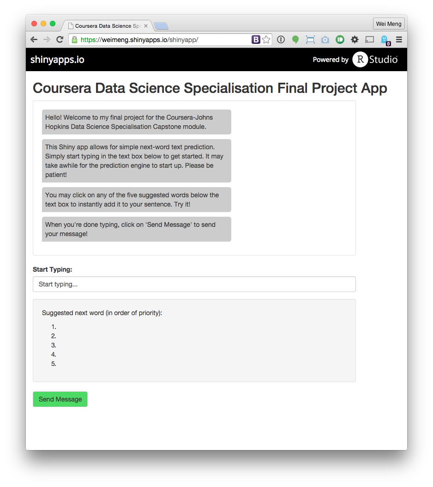

Chat App with Next Word Prediction Capability
========================================================
author: Wei-Meng Lee
date: 26 April 2015

Prepared for Coursera Johns Hopkins Data Science Specialisation Capstone Final Project

The App
========================================================

The app is a simple chat application, with the unique value proposition being a built-in text prediction algorithm.

The text prediction model was trained using the HC Copora corpus, comprising sources from blogs, news sites and Twitter messages.

The different sources were combined and profanity removed. The frequency of unigrams, bigrams and trigrams occurrences were then calculated in order to train the prediction model.

The app may be accessed here: https://weimeng.shinyapps.io/shinyapp/

App Interface
========================================================

The app was with simplicity and ease-of-use in mind.

Messages greet the user on first visit, introducing the app and giving brief instructions on how to use it.

The next word text suggestions are conveniently located below the text input box and can be clicked to be quickly added to the message.
***

Prediction Algorithm
========================================================

The prediction algorithm is a simple one:

1. Receive user input
2. Match the last two words of user's input to the most frequently occurring trigrams
3. If no match found, match the last word of user's input to most frequently occurring bigrams
4. If no match found, suggest the most frequently occurring unigrams

Next Steps
========================================================

The next word predictive abilities of the app can be further improved by generating frequency tables for higher order n-grams.

In addition, a weighted back off model can be used, such as the Stupid Backoff model proposed by [Brants et. al., 2007](http://www.aclweb.org/anthology/D07-1090.pdf).

The source code of the app may be found on [GitHub](https://github.com/weimeng/datasciencecoursera/tree/master/10-dsscapstone-003/shinyapp).
