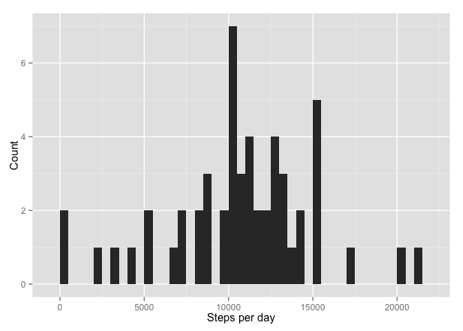
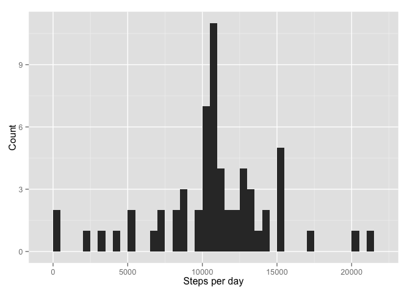
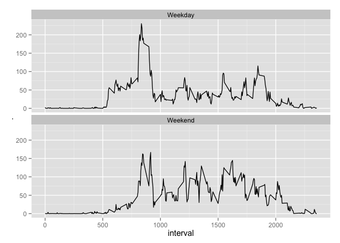

# Reproducible Research: Peer Assessment 1


## Loading and preprocessing the data

First, we load the dataset, which is stored in a comma-separated-value (CSV) 
file that has been compressed into the `activity.zip` archive.


```r
data <- read.csv(unz("activity.zip", "activity.csv"))
```

We then convert `data$date` to the `Date` class and `data$interval` to `factor`
class.


```r
data$date <- as.Date(data$date)
```

In addition, we prepare a separate dataset that removes observations with 
missing values.


```r
cleaned_data <- data[complete.cases(data),]
```

## What is mean total number of steps taken per day?

For this part of the report, we will be ignoring the missing values in the
dataset.


```r
library(plyr)
daily_data <- ddply(cleaned_data, "date", function(x) {
  data.frame(steps = sum(x$steps))
})
```

### 1. Make a histogram of the total number of steps taken per day


```r
library(ggplot2)
ggplot(daily_data, aes(x = daily_data$steps)) + geom_histogram(binwidth = 500) + xlab("Steps per day") + ylab("Count")
```

 

### 2. Calculate and report the *mean* and *median* total number of steps taken per day

To calculate the mean:

```r
mean(daily_data$steps)
```

```
## [1] 10766
```

To calculate the median:

```r
median(daily_data$steps)
```

```
## [1] 10765
```

## What is the average daily activity pattern?


```r
library(plyr)
interval_data <- ddply(cleaned_data, "interval", function(x) {
  data.frame(average.steps = sum(x$steps)/length(x$steps))
})
```

### 1. Make a time series plot of the 5-minute interval and the average number of steps taken, averaged across all days


```r
plot(interval_data, type="l")
```

 

### 2. Which 5-minute interval, on average across all the days in the dataset, contains the maximum number of steps?


```r
interval_data[interval_data$average.steps == max(interval_data$average.steps),]
```

```
##     interval average.steps
## 104      835         206.2
```

## Imputing missing values

### 1. Calculate and report the total number of missing values in the dataset


```r
incomplete.count <- count(complete.cases(data)); incomplete.count
```

```
##       x  freq
## 1 FALSE  2304
## 2  TRUE 15264
```

Therefore, there are 2304
missing values in the dataset.

### 2. Devise a strategy for filling in all of the missing values in the dataset

We will use the mean number of steps taken for that 5-minute interval across all 
days, rounded to the nearest whole number, to replace the missing data.

### 3. Create a new dataset that is equal to the original dataset but with the missing data filled in.


```r
filled_in_data <- data
incomplete_data <- filled_in_data[!complete.cases(filled_in_data),]

for(row in as.numeric(rownames(incomplete_data))) {
  interval <- filled_in_data[row, ]$interval
  average.steps <- interval_data[interval_data$interval == interval, ]$average.steps
  filled_in_data[row, ]$steps <- round(average.steps)
}
```

### 4. Make a histogram of the total number of steps taken each day and Calculate and report the mean and median total number of steps taken per day. Do these values differ from the estimates from the first part of the assignment? What is the impact of imputing missing data on the estimates of the total daily number of steps?


```r
daily_filled_data <- ddply(filled_in_data, "date", function(x) {
  data.frame(steps = sum(x$steps))
})
```


```r
library(ggplot2)
ggplot(daily_filled_data, aes(x = daily_filled_data$steps)) + geom_histogram(binwidth = 500) + xlab("Steps per day") + ylab("Count")
```

 

To calculate the mean:

```r
mean(daily_filled_data$steps)
```

```
## [1] 10766
```

To calculate the median:

```r
median(daily_filled_data$steps)
```

```
## [1] 10762
```


## Are there differences in activity patterns between weekdays and weekends?


```r
weekday_data <- filled_in_data
weekday_data$date <- weekdays(weekday_data$date)
weekday_data$date <- as.factor(weekday_data$date)
levels(weekday_data$date) <- list(Weekday = c("Monday", "Tuesday", "Wednesday",  
                                              "Thursday", "Friday"), 
                                  Weekend = c("Saturday", "Sunday"))
library(reshape2)
melted_data <- melt(weekday_data, id=c("date", "interval"))
casted_data <- dcast(melted_data, interval + date ~ ., mean)
ggplot(casted_data, aes(x = interval, y = .)) + geom_line() + facet_wrap(~ date, ncol=1)
```

 
