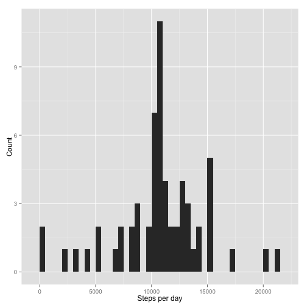
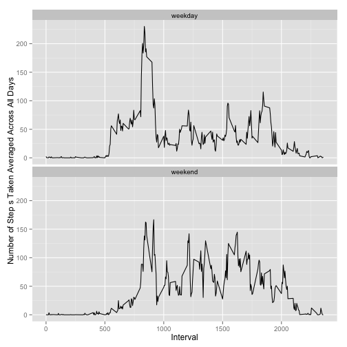

## Pre-requisites

This report requires the use of the following R library:


```r
library(ggplot2)
```

---

## Loading and preprocessing the data

> Show any code that is needed to
> 
> 1. Load the data (i.e. `read.csv()`)
> 2. Process/transform the data (if necessary) into a format suitable for your
>    analysis

The dataset is stored in a comma-separated-value (CSV) file that has been added
into the `activity.zip` archive. We will first unzip and read the CSV file:


```r
data <- read.csv(unz("activity.zip", "activity.csv"))
```

Then, we will convert the `date` column into a `Date` vector:


```r
data$date <- as.Date(data$date)
```

In addition, we prepare a separate dataset that removes observations with 
missing values:


```r
cleaned_data <- data[complete.cases(data),]
```

---

## What is mean total number of steps taken per day?

> For this part of the assignment, you can ignore the missing values in the dataset.
>
> 1. Make a histogram of the total number of steps taken each day
> 
> 2. Calculate and report the __mean__ and __median__ total number of steps taken per day

First, we aggregate the total number of steps taken for all intervals per date:


```r
daily_data <- aggregate(steps ~ date, cleaned_data, FUN = sum)
```

Then we make a histogram of the total number of steps taken per day:


```r
p <- ggplot(daily_data, aes(x = daily_data$steps))
p + geom_histogram(binwidth = 500) + xlab("Steps per day") + ylab("Count")
```

 

To calculate the mean steps taken per day:


```r
print(mean_steps_per_day <- mean(daily_data$steps))
```

```
## [1] 10766
```

To calculate the median steps taken per day:


```r
print(median_steps_per_day <- median(daily_data$steps))
```

```
## [1] 10765
```

---

## What is the average daily activity pattern?

> Make a time series plot (i.e. `type = "l"`) of the 5-minute interval (x-axis) 
> and the average number of steps taken, averaged across all days (y-axis)
>
> Which 5-minute interval, on average across all the days in the dataset, 
> contains the maximum number of steps?

First, we aggregate the average number of steps taken for each interval across
all dates:


```r
interval_data <- aggregate(steps ~ interval, cleaned_data, FUN = mean)
```

Then we make a time series plot of the 5-minute interval and the average number
of steps taken, averaged across all days:


```r
p <- ggplot(interval_data, aes(x = interval, y = steps))
p + geom_line() + xlab("Interval") +
                  ylab("Number of Step s Taken Averaged Across All Days")
```

 

To determine which 5-minute interval contains the maximum number of steps:


```r
print(max_interval <- interval_data[interval_data$steps == max(interval_data$steps),])
```

```
##     interval steps
## 104      835 206.2
```

Therefore, the 5-minute interval beginning at 835 contains
the maximum number of steps.

## Imputing missing values

> Note that there are a number of days/intervals where there are missing values 
> (coded as NA). The presence of missing days may introduce bias into some 
> calculations or summaries of the data.
>
> 1. Calculate and report the total number of missing values in the dataset 
>    (i.e. the total number of rows with NAs)
>
> 2. Devise a strategy for filling in all of the missing values in the dataset. 
>    The strategy does not need to be sophisticated. For example, you could use 
>    the mean/median for that day, or the mean for that 5-minute interval, etc.
>
> 3. Create a new dataset that is equal to the original dataset but with the 
>    missing data filled in.
>
> 4. Make a histogram of the total number of steps taken each day and calculate 
>    and report the __mean__ and __median__ total number of steps taken per day. 
>    Do these values differ from the estimates from the first part of the 
>    assignment? What is the impact of imputing missing data on the estimates of 
>    the total daily number of steps?

### Total number of missing values

Let's begin by calculating and reporting the total number of missing values in
the dataset.


```r
print(incomplete_count <- table(complete.cases(data)))
```

```
## 
## FALSE  TRUE 
##  2304 15264
```

Therefore, there are 2304 missing values in the 
dataset.

### Strategy for filling in all of the missing values in the dataset

The average number of steps taken for each 5-minute interval across all days
offers a fairly nuanced and granular approach to approximating the missing data.
It would be possible to get the average number of steps for the same day of the
week. However, we will forego this method for the sake of speed and brevity.

In addition, we will round up the average number of steps to the nearest whole 
number to avoid the presence of fractional steps in the data.

### Create a new dataset with the missing data filled in.


```r
filled_in_data <- data
incomplete_data <- filled_in_data[!complete.cases(filled_in_data),]

for(row in as.numeric(rownames(incomplete_data))) {
  interval <- filled_in_data[row, ]$interval
  average_steps <- interval_data[interval_data$interval == interval, ]$steps
  filled_in_data[row, ]$steps <- round(average_steps)
}
```

### Exploratory analysis of dataset with missing data filled in

First, aggregate the total number of steps taken for all intervals per date:


```r
daily_filled_data <- aggregate(steps ~ date, filled_in_data, FUN = sum)
```

Next, we make a histogram of the total number of steps taken each day:


```r
p <- ggplot(daily_filled_data, aes(x = daily_filled_data$steps)) 
p + geom_histogram(binwidth = 500) + xlab("Steps per day") + ylab("Count")
```

 

To calculate the mean steps taken per day:


```r
print(mean_steps_per_day_filled <- mean(daily_filled_data$steps))
```

```
## [1] 10766
```

To calculate the median steps taken per day:


```r
print(median_steps_per_day_filled <- median(daily_filled_data$steps))
```

```
## [1] 10762
```

Now, let's compare these values with the estimates from the first part of the
assignment:

|                   | Mean                          | Median                          |
| ----------------- | ----------------------------- | ------------------------------- |
| With missing data | 1.0766 &times; 10<sup>4</sup>        | 10765        |
| With imputed data | 1.0766 &times; 10<sup>4</sup> | 1.0762 &times; 10<sup>4</sup> |

We can see that the mean does not differ significantly between the dataset with
missing data and the dataset with imputed data.

However, the median for the dataset with missing data is higher than the dataset
with imputed data. However, the difference is less than 0.1% and is not highly
significant.

In summary, the imputing the missing data does not make a big impact on the 
estimates of the total daily number of steps.

---

## Are there differences in activity patterns between weekdays and weekends?

> For this part the `weekdays()` function may be of some help here. Use the 
> dataset with the filled-in missing values for this part.
>
> 1. Create a new factor variable in the dataset with two levels – “weekday” and
     “weekend” indicating whether a given date is a weekday or weekend day.
>
> 2. Make a panel plot containing a time series plot (i.e. `type = "l"`) of the 
>    5-minute interval (x-axis) and the average number of steps taken, averaged
>    across all weekday days or weekend days (y-axis).

First, we convert the dates in the imputed dataset to their respective days of 
the week using the `weekdays()` function and convert them to factors:


```r
filled_in_data$date <- weekdays(filled_in_data$date)
filled_in_data$date <- as.factor(filled_in_data$date)
```

Next, we process the days into two factors, either `weekday` or `weekend` as  
appropriate:


```r
levels(filled_in_data$date) <- list(weekday = c("Monday", "Tuesday", 
                                                "Wednesday", "Thursday", 
                                                "Friday"), 
                                    weekend = c("Saturday", "Sunday"))
```

Finally, we create a panel plot containing a time series plot of the 5-minute
interval and the average number of steps taken, averaged across all weekday days
or weekend days:


```r
interval_data_by_weekday <- aggregate(steps ~ ., filled_in_data, FUN = mean)
p <- ggplot(interval_data_by_weekday, aes(x = interval, y = steps))
p + geom_line() + facet_wrap(~ date, ncol=1) + 
    xlab("Interval") + ylab("Number of Step s Taken Averaged Across All Days")
```

 

We can see that there is a significantly higher number of steps taken in the 
mornings for weekdays as compared to weekends. 

However, the number of steps taken is generally higher for most of the waking
hours of the day for weekends.
